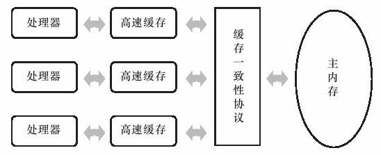
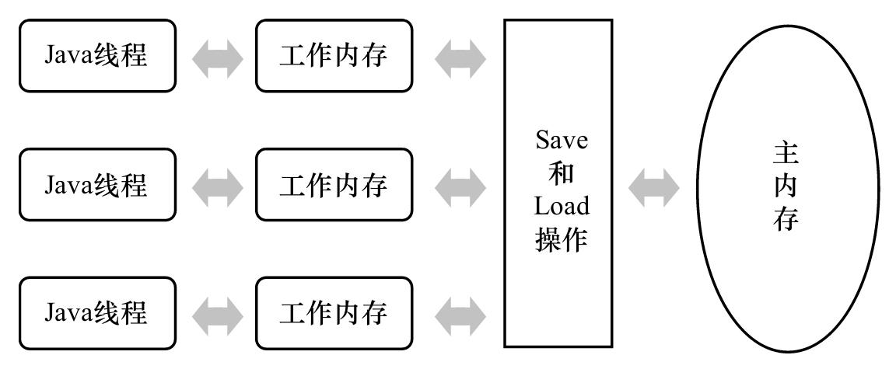

#`java` 高并发
##java 内存模型
1. 先讨论一下计算机的内存模型
目前由于计算机的存储设备和处理器的运算速度有几个数量级的差距，所以会在内存与处理器之间加入一层高速缓存(尽可能接近处理器的运算速度)：将运算需要使用到的数据复制到缓存中，让运算能快速进行，当运算结算之后，再将缓存同步会内存中，这样处理器不需要等待缓慢的内存读写.下图为计算机的内存模型.
{:height=300 width=600}
2. java 内存模型
java虚拟机不像其他语言依赖的是计算机的内存模型，单独建立了一套与计算相似的内存模型(如下图)，所以java语言可以在不同的平台上运行。
{:height=300 width=600}


## java 内存交互
关于java主内存与工作内存之间的交互协议，Java内存模型中定义了8种操作来完成，虚拟机的实现必须保证8种操作必须是原子的。
###8种操作如下
1. lock(锁定)
> 主要作用于主内存的变量，它把一个变量表示为一个线程独占的状态。
2. unlock(解锁)
> 作用于主内存的变量，把一个变量从锁定状态释放出来，释放后该变量才能被其他线程访问。
3. read
> 作用于主内存的变量，把一个变量从主内存传输到工作内存中，以便后续的load操作使用。
4. load
> 作用于工作内存的变量，将从主内存read得到的变量放入工作内存的副本中。
5. use
> 作用于工作内存的变量，把工作内存中的变量的值传递给执行引擎，每当虚拟机遇到一个需要使用变量值的字节码指令时会执行这个操作。
6. assign
> 作用于工作内存的变量，将一个从执行引擎接收到的值赋值给工作内存变量，当虚拟机遇到赋值的字节码指令时执行这个操作。
7. store
> 作用于工作内存变量，将工作内存中一个变量的值传输到主内存中，以便write操作使用。
8. write
> 作用于主内存的变量，将store操作后的变量的值放入主内存的变量中。


###8中操作的约束
> 如果要把一个变量从主内存复制到工作内存，需要顺序执行read与load操作；同样如果要把工作内存中的变量同步回主内存，则需要顺序执行store与write操作.Java内存模型要求上述两种操作顺序执行，但是不需要连续执行，也就是说中间可以穿插其他指令.除此之外，java内存模型还规定在执行上述8种操作的时候必须满足系列规则：

1. 不允许read与load,store与write操作之一单独出现，也就是说不允许一个变量读取了但是工作内存不接收或者工作内存发起回写但是主内存不接受的情况
2. 不允许一个线程丢弃它最近的assign操作，即变量在工作内存赋值之后一定要同步回主内存中。
3. 不允许一个线程在没有assign操作的前提下将数据从工作内存同步到主内存中。
4. 一个新的变量只能在主内存中产生，不允许在工作内存中直接使用一个没有初始化(load或assign)的变量。也就是说对一个变量实施use、store之前，必须先执行过assign和load操作。
5. 一个变量同一时刻只能一个线程对其进行lock操作，但是可以被同一个线程多次重复lock(`ReentrantLock` 重入锁)，多次执行lock之后要进行相同次数的unlock，变量才会被解锁.
6. 对变量进行lock操作，会将工作内存中此变量的值情况，执行引擎使用这个变量的时候，需要先进行load或assign操作初始化变量的值。
7. 如果一个变量没有被lock，则不能对其执行unlock，也不允许去unlock其他线程lock住的变量。
8. 线程对一个变量进行unlock之前，必须先将变量的值同步回主内存中(执行store和write操作)。

`volatile`操作在此基础上增加一些约束条件.其约束条件如下：
1. 线程对`volatile`变量的use、load、read必须是关联出现的，这条规则要求在工作内存中每次使用此变量的时候，都必须从主内存中读取最新的值，即保证能看见其他线程对此变量做的更新.
2. 线程对`volatile`变量的assign、store、write操作是关联出现的，这条规则要求在工作内存中每次修改此变量的值之后必须同步回主内存，保证其他线程能看到本线程对此变量所做的修改。
3. 假定动作A是线程T对变量V实施的use或 assign动作,假定动作F是和动作A相关联的load或store动作,假定动作P是和动作F相应的对变量V的read或wite动作;类似的,假定动作B是线程T对变量W实施的use或 assign动作,假定动作G是和动作B相关联的load或 store动作,假定动作Q是和动作G相应的对变量W的read或write动作。如果A先于B,那么P先于Q(这条规则要求 volatile修饰的变量不会被指令重排序优化,保证代码的执行顺序与程序的顺序相同)

`volatile`是java虚拟机最轻量级的同步机制，它具备两种特性：
1. 保证被`volatile`修饰的变量对所有线程是可见的
> 对`volatile`变量所有的写操作都能立即反应到其他线程中，保证了变量的修改对其他线程是可见的，但是不能保证并发下运算是线程安全的. 如下代码所示，如果线程安全，返回结果应该是200000，但是实际上返回的比这个值小，而且是不定的。
```java

public class VolatileTest {
    public static volatile int count = 0;
    
    public static void increase() {
        count++;
    }
    
    public static void main(String[] args) {
        int num = 20;
        Thread[] threads = new Thread[num];
        for(int i = 0; i < num; i ++) {
            threads[i] = new Thread(new Runnable() {
                public void run() {
                    for(int j = 0; j < 10000; j++) {
                        increase();
                    }
                }
            });
            threads[i].start();
        }
        
        while(Thread.activeCount() > 1)
            Thread.yield();
        
        System.out.println(count);
    }
}   
```

2. 禁止指令被重排序
> 普通变量仅仅会保证该方法的执行过程中所有依赖赋值结果的地方获取到正确的结果，并不能保证赋值操作与代码顺序是一致的。


